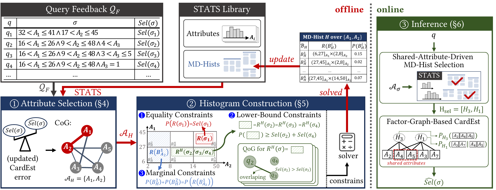

# Metis

Metis is a workload-aware framework for constructing and utilizing multidimensional histograms (MD-Hists) for accurate cardinality estimation.

<p align="center">
  <br>
  <em>Overview of the Metis framework.</em>
</p>

Given query feedback, Metis performs three steps: ① identifies high-utility attribute subsets; ② constructs MD-Hists using probabilistic constraints derived from query feedback; ③ estimates cardinalities for unseen queries via histogram combination.

This repository provides the executable implementation of Metis for reproducing its construction and evaluation on real-world workloads.

## ⚙️ Requirements

- Java 21 or later
- Maven 3.x
- Gurobi Optimizer 13.0.0. This program depends on Gurobi Optimizer 13.0.0. Before running, please make sure Gurobi is
    installed and a valid license is configured on your machine. Academic users may apply for a free academic license through [Gurobi's official website](https://support.gurobi.com/hc/en-us/articles/360040541251-How-do-I-obtain-a-free-academic-license).

## 📄 Dataset and Workload

- The full datasets and workloads used in the paper are [available on Google Drive](https://drive.google.com/drive/folders/1yfR5zeX2td1fjOU0rP_t6fJJQ9e8srOo?usp=sharing).
- After downloading, extract them under the project root to obtain `Expr_Data/` and `Expr_Workload/`. Note, Metis caches single-attribute statistics under `Expr_Data/dump/`.  The first run may take longer as single-attribute statistics are constructed and cached.

## 🚀 Quick Start

Run Metis on three workloads with the provided jar (`metis.jar`):

```bash
# Census
java -jar metis.jar Expr_Workload/census/train_10w.json Expr_Workload/census/test_5k.json Expr_Data/census.csv

# DMV
java -jar metis.jar Expr_Workload/dmv/train_10w.json Expr_Workload/dmv/test_5k.json Expr_Data/date.csv --withHeader

# Instacart
java -jar metis.jar Expr_Workload/instacart/train_10w.json Expr_Workload/instacart/test_5k.json Expr_Data/order_wide_clean.csv --withHeader
```

## 🔧 Build Instructions

To build the project, run: `mvn package`. 

After compilation, the executable JAR file is generated at `target/metis.jar`.

Run Metis on a dataset: `java -jar target/metis.jar <train_queries.json> <test_queries.json> <data.csv> [--withHeader] [--limit=<size_in_kb>]`.

- `<train_queries.json>`  Path to the training workload file. Used to construct multidimensional histograms.
- `<test_queries.json>`  Path to the test workload file. Used to evaluate cardinality estimation on unseen queries.
- `<data.csv>`  Path to the dataset file. 
- `--withHeader`  Indicates that the CSV file contains a header row. If specified, the first row will be skipped during data loading.
- `--limit=<size_in_kb>`  Specifies the memory budget (in KB) for histogram construction. 

## 📜 License

This project is licensed under the terms of the LICENSE file in this repository.

## 📬 Contact

For questions or issues, please open a GitHub issue or contact the authors.